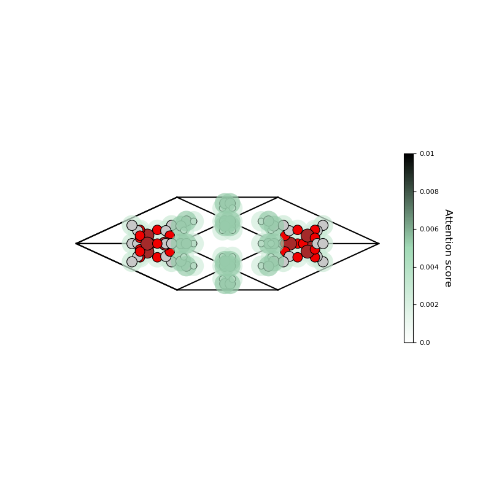
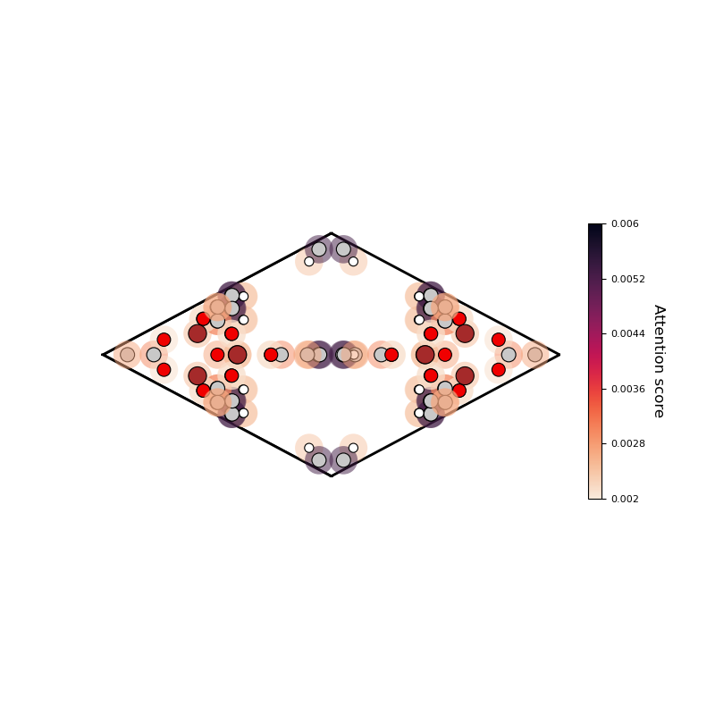
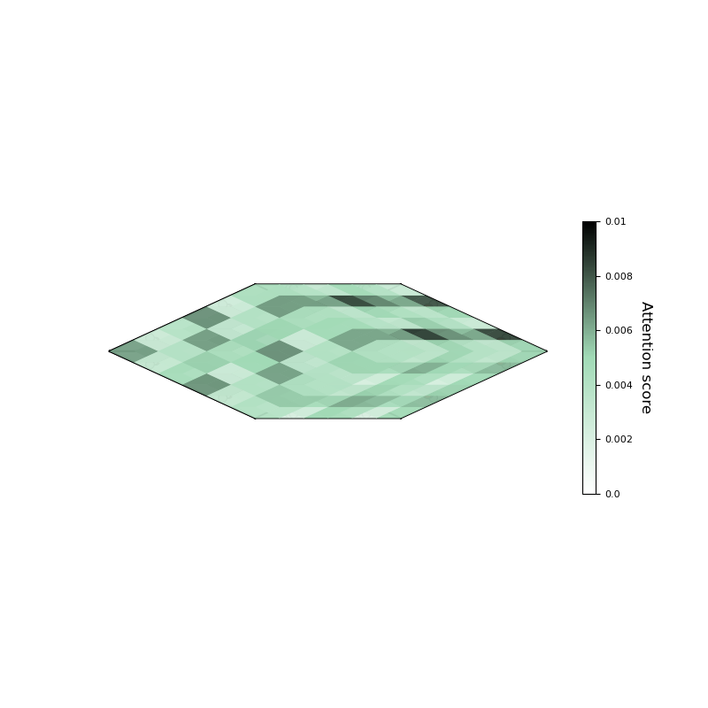
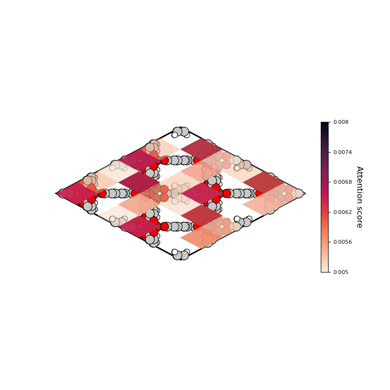
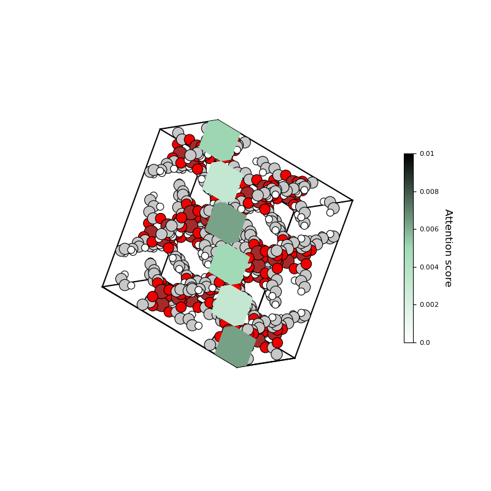
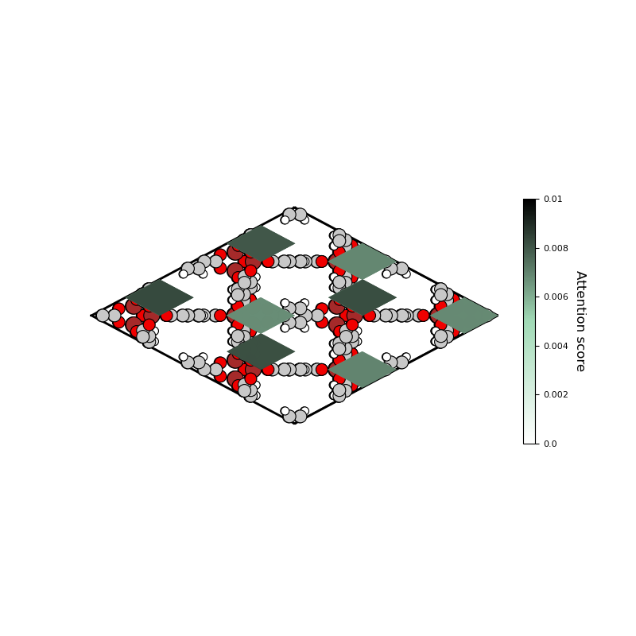
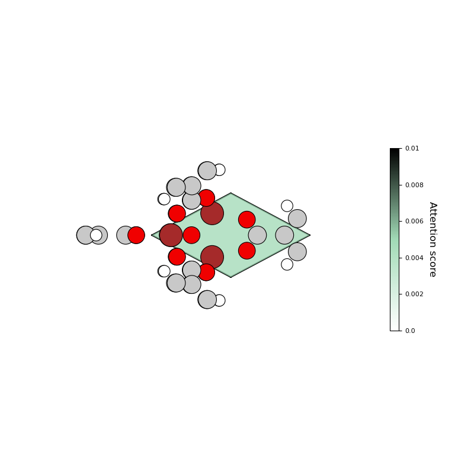
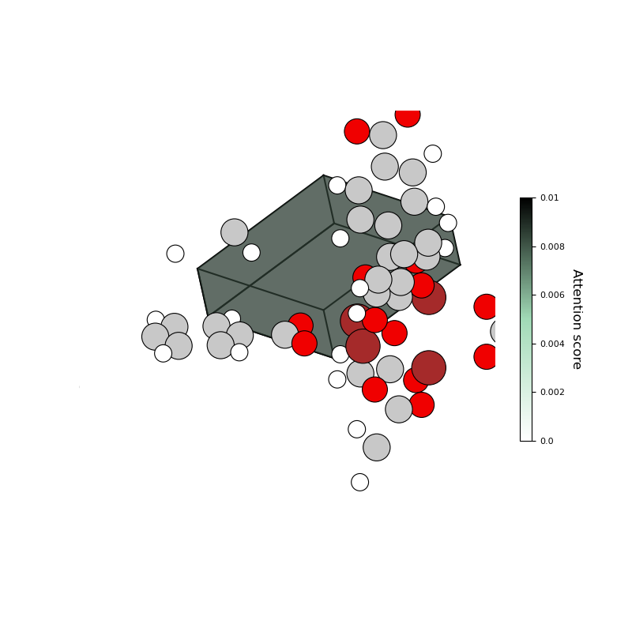

# Feature Importance Analysis

An interpretation of feature importance can provide a better understanding of relationships between structures and properties. \
Given that the attention scores measure how much it should pay attention to the inputs when predicting the desired properties, 
the attention layers of the Transformer allow assigning high attention scores to the input features according to their importance. \
As such, we can analyze feature importance using attention scores from fine-tuning models.

`PatchVisualizer` is a class that visualizes structures with attention scores. 
```python
from visualize import PatchVisualizer
```

## Visualization 
In this sectinon, you will analyze feature importance with the finetuned model we've provided. 
you need to download the finetuned models (e.g. band gap, h<sub>2</sub> uptake) 
please refer to dataset.md to download the ckpt files

Here is an example to build `PatchVisualizer` with a cif file:
```python
from visualize import PatchVisualizer

model_path = "examples/finetuned_bandgap.ckpt" # or 'examples/finetuned_h2_uptake.ckpt'
data_path = 'examples/visualize/dataset/'
cifname = 'MIBQAR01_FSR'

vis = PatchVisualizer.from_cifname(cifname, model_path, data_path)
```

or You can build  `PatchVisualizer` with a directory that contains cif files.
In this case, you can choose the cif file by index.
```python
from visualize import PatchVisualizer

model_path = "examples/finetuned_bandgap.ckpt" # or 'examples/finetuned_h2_uptake.ckpt'
data_path = './examples/visualize/dataset/'
batch_id = 0

vis = PatchVisualizer.from_index(0, model_path, data_path)
```

### Visualize Atom-based Graph Embeddings
Here is an example of visualization with attention scores of atom-based graph embeddings:
```python
%matplotlib widget
vis.draw_graph()
```


You can change some parameters of visualization that belong to parameters of `matplotlib`:
```python
%matplotlib widget
minatt, maxatt = 0.002, 0.006
view_init=(0, -55)
cmap = 'rocket_r'
alpha = 0.5
grid_scale_factor = 1.8
atomic_scale_factor = 1.5
att_scale_factor= 3
vis.draw_graph(minatt=minatt, maxatt=maxatt, view_init=view_init, alpha=alpha, cmap=cmap,
               grid_scale_factor=grid_scale_factor, 
               atomic_scale_factor=atomic_scale_factor,
               att_scale_factor=att_scale_factor)
```


### Visualize Energy-grid Embeddings
Here is an example of visualization with attention scores of Energy-grid embeddings:
```python
%matplotlib widget
vis.draw_grid()
```


Likewise, you can change parameters of visualization.
If you want to visualize only patches that have higher attention scores than the minimum attention score `min_att`.
You just change a parameter `remove_under_mitatt` is True. 
```python
%matplotlib widget
minatt, maxatt = 0.005, 0.008
view_init=(0, -55)
cmap = 'rocket_r'
alpha = 0.3
grid_scale_factor = 1.8
atomic_scale_factor = 2

vis.draw_grid(minatt=minatt, maxatt=maxatt, view_init=view_init, alpha=alpha, cmap=cmap,
              grid_scale_factor=grid_scale_factor, 
              atomic_scale_factor=atomic_scale_factor, 
              remove_under_minatt=True)
```


Also, you can visualize patches with patch positions out of 6 X 6 X 6 patches. 
```python
%matplotlib widget
view_init=(27, -92)
alpha = 1
grid_scale_factor = 1.8
atomic_scale_factor = 2
patch_list = [[0,0,0], [1,1,1], [2,2,2], [3,3,3], [4,4,4], [5,5,5]] # make list to patch 

vis.draw_grid(view_init=view_init, alpha=alpha,
              grid_scale_factor=grid_scale_factor, 
              patch_list=patch_list,
              atomic_scale_factor=atomic_scale_factor)
```


If you want to visualize patches according to a rank of attention scores of patches, you can use a `rank` parameter.
```python
%matplotlib widget
view_init = (0, 125)
grid_scale_factor=1.8
atomic_scale_factor=1.5
rank = range(20)

vis.draw_grid_with_attention_rank(rank, view_init=view_init, 
                                  grid_scale_factor=grid_scale_factor,
                                  atomic_scale_factor=atomic_scale_factor)
```


You can visualize a patch at a specific position of patches
```python
%matplotlib widget
patch_position = [2, 2, 2]
view_init = (0, -55)

vis.draw_specific_patch(patch_position, alpha=0.5, view_init=view_init)
```


Also, you can visualize a patch with a rank of attention scores of patches.
```python
view_init = (15, -58)

vis.draw_specific_patch_with_attention_rank(1, alpha=0.5, ep=0.8, 
                                            view_init = view_init,
                                           grid_scale_factor=2)
```
